# Design Diagram

This diagram is a first-class project artifact. It shows all currently implemented
types and their relationships, organized by source module. Archive types are excluded.

`AgentEnvironment` (a type alias) is shown as a box with a `<<type alias>>` stereotype
to make the environment extensibility axis visually parallel to the framework axis.
`AgentEnvironmentT` is a TypeVar bound to `AgentEnvironment` used in generic code that
needs to preserve the concrete environment type; it has no class-diagram representation.

## PR update policy

Every PR that touches `src/agentrelay/` must include a commit to this file:

- **If the design changed**: update the diagram to reflect the new types or relationships.
- **If the design did not change**: add a comment at the bottom of this file noting the
  PR number and confirming no diagram changes are needed. The file must still change so
  that diagram review is an explicit, visible step in every PR.

## Diagram

> **Tip:** For interactive pan/zoom, view this diagram on
> [GitHub](https://github.com/duanegoodner/agentrelay/blob/main/docs/DIAGRAM.md).

```mermaid
classDiagram
    namespace task_py {
        class AgentRole {
            <<enumeration>>
            SPEC_WRITER
            TEST_WRITER
            TEST_REVIEWER
            IMPLEMENTER
            GENERIC
        }

        class AgentFramework {
            <<enumeration>>
            CLAUDE_CODE
        }

        class AgentVerbosity {
            <<enumeration>>
            NONE
            STANDARD
            DETAILED
            EDUCATIONAL
        }

        class TaskPaths {
            <<frozen dataclass>>
            src : tuple[str, ...]
            test : tuple[str, ...]
            spec : str | None
        }

        class AgentConfig {
            <<frozen dataclass>>
            framework : AgentFramework
            model : str | None
            adr_verbosity : AgentVerbosity
            environment : AgentEnvironment
        }

        class ReviewConfig {
            <<frozen dataclass>>
            agent : AgentConfig
            review_on_attempt : int
        }

        class Task {
            <<frozen dataclass>>
            id : str
            role : AgentRole
            description : str | None
            paths : TaskPaths
            dependencies : tuple[Task, ...]
            completion_gate : str | None
            max_gate_attempts : int | None
            primary_agent : AgentConfig
            review : ReviewConfig | None
            workstream_id : str
        }
    }

    namespace task_graph {
        class TaskGraph {
            <<frozen dataclass>>
            name : str | None
            max_workstream_depth : int
            +task(task_id) Task
            +task_ids() tuple[str, ...]
            +dependency_ids(task_id) tuple[str, ...]
            +dependent_ids(task_id) tuple[str, ...]
            +roots() tuple[str, ...]
            +leaves() tuple[str, ...]
            +topological_order() tuple[str, ...]
            +ready_ids(completed_ids, running_ids) tuple[str, ...]
            +workstream_ids() tuple[str, ...]
            +workstream(workstream_id) WorkstreamSpec
            +tasks_in_workstream(workstream_id) tuple[str, ...]
            +child_workstream_ids(workstream_id) tuple[str, ...]
        }

        class validation {
            <<module>>
            module_path : task_graph.validation
            +normalize_workstreams(workstreams_by_id)$ dict[str, WorkstreamSpec]
            +validate_task_workstream_ids(tasks_by_id, workstreams_by_id)$ void
            +validate_workstream_parent_ids_exist(workstreams_by_id)$ void
            +validate_workstream_hierarchy_acyclic(workstreams_by_id)$ void
            +validate_workstream_max_depth(workstreams_by_id, max_depth)$ void
            +validate_task_identity_consistency(tasks_by_id)$ void
            +validate_dependencies_exist(tasks_by_id, dependency_ids)$ void
            +validate_known_ids(ids, tasks_by_id, source_name)$ void
        }

        class indexing {
            <<module>>
            module_path : task_graph.indexing
            +build_dependency_ids(tasks_by_id)$ dict[str, tuple[str, ...]]
            +build_dependent_ids(tasks_by_id, dependency_ids)$ dict[str, tuple[str, ...]]
            +topological_order_or_raise(dependency_ids, dependent_ids)$ tuple[str, ...]
            +build_task_ids_by_workstream(tasks_by_id, topological_order, workstreams_by_id)$ dict[str, tuple[str, ...]]
            +build_child_workstream_ids(workstreams_by_id)$ dict[str, tuple[str, ...]]
        }

        class TaskGraphBuilder {
            +from_yaml(path)$ TaskGraph
            +from_dict(data)$ TaskGraph
        }
    }

    namespace task_runtime_builder_py {
        class TaskRuntimeBuilder {
            +from_graph(graph)$ dict[str, TaskRuntime]
        }
    }

    namespace task_runner_py {
        class TaskCompletionSignal {
            <<frozen dataclass>>
            outcome : "done" | "failed"
            pr_url : str | None
            error : str | None
        }

        class TaskRunnerIO {
            <<protocol>>
            +prepare(runtime) void
            +launch(runtime) Agent
            +kickoff(runtime) void
            +wait_for_completion(runtime) TaskCompletionSignal
            +merge_pr(runtime, pr_url) void
            +teardown(runtime) void
        }

        class TaskRunResult {
            <<frozen dataclass>>
            task_id : str
            status : TaskStatus
            pr_url : str | None
            error : str | None
        }

        class TaskRunner {
            <<mutable dataclass>>
            io : TaskRunnerIO
            +run(runtime)$ TaskRunResult [stub]
        }
    }

    namespace workstream_py {
        class WorkstreamSpec {
            <<frozen dataclass>>
            id : str
            parent_workstream_id : str | None
            base_branch : str
            merge_target_branch : str
        }
    }

    namespace environments_py {
        class AgentEnvironment {
            <<type alias>>
        }

        class TmuxEnvironment {
            <<frozen dataclass>>
            session : str
        }
    }

    namespace addressing_py {
        class AgentAddress {
            <<abstract>>
            +label() str
        }

        class TmuxAddress {
            <<frozen dataclass>>
            session : str
            pane_id : str
            +label() str
        }
    }

    namespace agent_py {
        class Agent {
            <<abstract>>
            +send_kickoff(instructions_path)* void
            +address()* AgentAddress
        }

        class TmuxAgent {
            <<mutable dataclass>>
            -_address : TmuxAddress
            +address() TmuxAddress
            +from_config()$ TmuxAgent [stub]
            +send_kickoff(instructions_path) [stub]
        }
    }

    namespace task_runtime_py {
        class TaskStatus {
            <<enumeration>>
            PENDING
            RUNNING
            PR_CREATED
            PR_MERGED
            FAILED
        }

        class TaskState {
            <<mutable dataclass>>
            status : TaskStatus
            worktree_path : Path | None
            branch_name : str | None
            error : str | None
            attempt_num : int
        }

        class TaskArtifacts {
            <<mutable dataclass>>
            pr_url : str | None
            concerns : list[str]
        }

        class TaskRuntime {
            <<mutable dataclass>>
            task : Task
            state : TaskState
            artifacts : TaskArtifacts
            agent : Agent | None
        }
    }

    Task --> AgentRole : role
    Task --> TaskPaths : paths
    Task --> AgentConfig : primary_agent
    Task --> ReviewConfig : review (optional)
    Task ..> WorkstreamSpec : workstream_id (ref)
    AgentConfig --> AgentFramework : framework
    AgentConfig --> AgentVerbosity : adr_verbosity
    ReviewConfig --> AgentConfig : agent
    TaskGraph --> Task : contains
    TaskGraph --> WorkstreamSpec : contains
    validation --> TaskGraph : validates inputs for
    indexing --> TaskGraph : builds indexes for
    TaskGraphBuilder --> TaskGraph : builds
    TaskGraphBuilder --> Task : constructs
    TaskRuntimeBuilder --> TaskGraph : reads
    TaskRuntimeBuilder --> TaskRuntime : builds
    TaskRunner --> TaskRunnerIO : uses
    TaskRunner --> TaskRuntime : mutates
    TaskRunner --> TaskRunResult : returns
    TaskRunnerIO --> Agent : launches
    TaskRunnerIO --> TaskCompletionSignal : returns
    TaskRunResult --> TaskStatus : status
    AgentConfig --> AgentEnvironment : environment
    TmuxEnvironment ..|> AgentEnvironment
    TmuxAddress --|> AgentAddress
    TmuxAgent --|> Agent
    TmuxAgent --> TmuxAddress : _address
    Agent --> AgentAddress : address
    TaskState --> TaskStatus : status
    TaskRuntime --> Task : task
    TaskRuntime --> TaskState : state
    TaskRuntime --> TaskArtifacts : artifacts
    TaskRuntime --> Agent : agent (optional)
```

---

*PR docs/mkdocs-design: No architectural changes. `src/agentrelay/my_package/` is a
docs-only example module demonstrating mkdocstrings; it is not part of the core design.*

*PR docs/cleanup: No architectural changes. Renamed `src/agentrelay/archive/` →
`src/agentrelay/prototypes/v01/`; this is a reference-only directory not reflected
in the core design diagram.*
